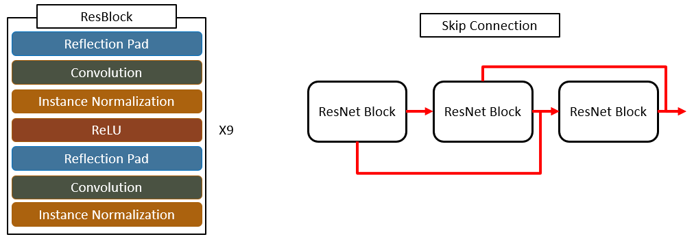

# CycleGAN  
  

CycleGAN은 비지도학습 유형중 GAN을 이용한 딥러닝 네트워크 입니다.  
기존 GAN은 서로 짝이 맞는 데이터가 있어야 했는데, CycleGAN은 짝이 안 맞는 이미지간 학습이 가능하다는 특징이 있습니다.  

## GAN과 SuperResolution
CycleGAN은 적대적 생성 신경망인 GAN 기반 딥러닝 네트워크 입니다.  
CycleGAN을 설명하기에 앞서 GAN을 설명하려고 합니다.
  

**GAN**  
 

GAN은 대표적인 비지도학습 네트워크 입니다.  
지도학습과의 차이점은 Label 데이터가 없다는 뜻입니다.  
지도학습은 Label이 있기 때문에 해당 Label과 같아 지기 위하여 파라미터들을 갱신합니다.  
이와 다르게 비지도 학습은 Label이 없기 때문에 비슷한 특징을 가진 입력 데이터들 간의 군집화를 합니다.  
예를 들면 호랑이, 사자, 기린을 입력데이터로 준다고 하면 호랑이와 사자는 육식동물 기린은 초식동물로 특징을 잡아 분류를 합니다.  

GAN의 간단한 구조는 그림[4]와 같습니다.  
Generator를 통해 거짓 이미지를 만듭니다.  
Discriminator는 만들어진 거짓 이미지와 진짜 이미지를 구분을 합니다.  
Generator는 Discriminator가 판단한 결과를 이용하여 진짜 같은 가짜 이미지를 만들려고 학습합니다.  
Discriminator는 Generator가 만든 진짜 같은 가짜 이미지와 진짜 이미지를 판단하려고 학습합니다.  
이와 같이 서로 적대적으로 학습하면서 가짜 이미지를 생성한다고 해서 적대적 생성 신경망 이라고 불립니다.  

**기존 GAN의 문제점**  
  
CycleGAN 이전의 네트워크들은 이미지를 전환하거나 생성하기 위해서 서로 짝이 되는 사진이 있어야 했습니다.  
(모양, 위치 등이 동일한 이미지 세트)  
예를 들면 말을 얼룩말로 바꾸기 위해서는 똑같은 포즈의 말과 얼룩말 사진이 있어야 되는 것입니다.  
하지만 이러한 짝이 되는 이미지를 구하기는 쉽지가 않습니다.  

CycleGAN에서는 이러한 문제를 해결합니다.  
짝이 맞지 않는 이미지간 학습으로 서로 유사한 이미지를 만듭니다.  

  
## CycleGAN 전체 네트워크 구조 - GENERATOR
  
CycleGAN의 전체 네트워크 구조입니다.  
X가 가짜 이미지를 만들고 판단한 결과를 이용하여 X를 다시 만들고 Y도 이와 같이 진행됩니다.  
최종적으로는 서로 간의 특징을 가진 새로운 X, Y 이미지를 생성합니다.  

**Generator – Reflection Padding, Instance Normalization**  
  
CycleGAN의 Generator 네트워크 구조입니다.  
우선 입력 이미지(X, Y)를 대상으로 Reflection Pad를 진행합니다.  
기존 Zero Padding과 달리 해당 방식은 입력 이미지의 데이터를 이용하여 Padding을 진행합니다.  
이러한 이유로 Padding이 진행된 값들은 원래 이미지처럼 보이기 때문에 GAN등의 모델의 성능을 더 올려줍니다.  

그 후 Convolution 7*7 필터 64개를 이용하여 합성곱 연산을 진행합니다.  
Batch Normalization 대신 Instance Normalization 기법으로 데이터를 정규화 하고
ReLU 함수를 통과시킵니다.  
  
Batch Normalization 기법은 데이터를 Batch 단위, 채널 단위로 정규화를 진행하는 기법입니다.  
Instance Normalization 기법은 Batch 단위 전체가 아닌 각각을 따로 정규화를 진행하는 기법입니다.  
Normalization 기법은 이외에도 Layer Normalization, Group Normalization 등이 있습니다.  

**Generator – Down Sampling**  
  
특징을 추출하기 위하여 다운 샘플링을 진행합니다.  
Stride를 2로 설정합니다.  

**Generator – ResNet Block**  
  
특징 추출을 위한 Down Sampling을 진행한 뒤 ResBlock 9개를 통과하여 특징을 추출합니다.  
우선 Reflection Padding을 진행합니다.  
합성곱 층, 정규화 층, ReLU층을 한번 통과한 뒤 처음부터 한번 더 수행합니다.
마지막은 ReLU를 통과하지 않습니다.  
이 때 사용되는 필터의 크기는 3*3으로 동일합니다.  

최종적으로 256*256 이상의 해상도의 이미지는 9개의 ResBlock을 통과하며, 각각을 통과할 때마다 스킵 커넥션을 통해 그 이전 결과를 반영하며 통과합니다.  

**Generator – Up Sampling**  
  
Resnet Block을 통한 매핑이 끝난 뒤 특징 추출을 위해 다운 샘플링을 한 것과 반대로 업 샘플링을 진행합니다.
업 샘플링은 Deconvolution중 하나인 Convolutional Transpose 네트워크를 이용합니다.

**Convolutional Transpose**
  
  
CycleGAN은 업 샘플링 과정에서 Convolutional Transpose 연산을 수행합니다.  
이 연산이 어떻게 수행되는지 자세히 추가로 설명하려고 합니다.  
각각의 그림은 왼쪽이 Convolution 연산, 오른쪽이 Convolution Transpose 연산 과정입니다.  
Convolution 연산은 특정한 필터의 크기만큼 이미지의 특징 값들을 합쳐서 하나로 만드는 Many to One의 관계를 형성합니다.  
이와 반대로 Convolution Transpose 연산은 하나의 값으로 부터 여러가지를 만드는 One to Many의 관계를 형성합니다.  
이러한 이유로 Deconvolution 연산이라고도 불립니다.  

Convolution Transpose 연산의 구체적인 방식은 두 번째 그림과 같습니다.  
우선 각 특징 값 주변에 Out Padding을 이용하여 각각을 떨어트립니다.  
그 후 빈 공간을 0으로 채웁니다.  
외각 지역도 마찬가지로 Zero-Padding 연산을 이용하여 0으로 채웁니다.  
최종적으로 Convolution 연산을 수행하여 이미지를 업 샘플링 합니다.  

**Reflection Padding**
  
업 샘플링 단계 후에 마무리 단계입니다.  
마찬가지로 Reflection Pad를 이용하여 이미지 값을 이용하여 패딩 값을 채워서 GAN의 성능을 높입니다.  
그 후, 1개의 Convolution 층을 통과하여 활성화 함수를 통과하는데 이전과 달리 Tanh 함수를 사용합니다.  
  
tanh 함수(Hyperbolic tangent function) 하이퍼볼릭탄젠트는 쌍곡선 함수 중 하나입니다.   
쌍곡선 함수란 삼각함수와 유사한 성질을 가지고, 표준 쌍곡선을 매개변수로 표시할 때 나오는 함수입니다.  
하이퍼볼릭탄젠트 함수는 시그모이드 함수를 transformation해서 얻을 수 있습니다.
tanh 함수는 함수의 중심 값을 0으로 옮겨 sigmoid의 최적화 과정이 느려 지는 문제를 해결했습니다.  
하지만 미분함수에 대해 일정 값 이상 커질 시 미분 값이 소실되는 Gradient Vanishing 문제는 여전히 남아있습니다.  

## CycleGAN 전체 네트워크 구조 - DISCRIMINATOR  
  
CycleGAN의 Discriminator 네트워크 구조입니다.  
총 3단계의 Convolution 층을 통과합니다.  
각 층을 통과할 때마다 채널의 개수를 64 -> 128 -> 256 으로 점차 증가시켜서 더 세밀하게 특징 값을 추출합니다.  
마지막 Convolution 층을 통과하여 처음 채널로 다시 업 샘플링 합니다.  
여기서 특이점은 Generator가 생성한 하나의 이미지가 아닌 이전 50장의 이미지를 사용한 점입니다.  

## CycleGAN 활성화 함수, 최적화 함수, 목적함수
CycleGAN의 최적화 함수, 목적 함수, 활성화 함수 입니다.  
최적화 함수는 Loss, Cost 값을 최소화 하기 위하여 가중치(weight parameters)들을 최적화 하는 함수입니다.  
사용된 함수는 Adam입니다.  
Adam은 momentum 함수와 AdaGrad 함수를 합친 함수로 learning rate의 변화에 관성을 부여하고 그 간격 또한 많이 변한 변수들은 step size를 작게 합니다.  
(작게 하는 이유는 많이 변한 변수들은 그 근처에 최적 값이 있을 거라고 예상하기 때문)  
  
목적함수는 cost, loss 비용을 구하는 함수입니다.  
Cost Function은 하나의 데이터 셋에 대한 오차 값을 구하는 함수를 의미하며 Loss Function은 한 번의 학습에 대한 평균 오차 값을 구하는 함수입니다.  
목적함수로 MSE를 사용했고 효과를 최대화 하기 위하여 다음 페이지의 방식을 이용하였습니다.  
  
활성화 함수는 순전파 과정에서 결정된 신호(데이터)의 세기를 결정하는 함수입니다.  
Generator 에서는 ReLU를 사용하였고 마지막에만 tanh를 사용하였습니다.  
Discriminator 에서는 Leaky ReLU를 사용하였습니다.  

**목적함수 구조(Objective Function)**  
  
CycleGAN 목적함수 입니다.  
우선 Generator의 목적함수는 총 6개의 Cost Function으로 구성되어 있습니다.  
Generator A를 통해 생성된 Fake B를 판단한 결과와 정상 Discriminator의 판단결과 정상이라고 판단되는 1.0과 Cost를 계산하여 Loss_G_A 를 구합니다.  
마찬가지로 Generator B를 통해 생성된 Fake A를 판단한 결과와 정상 Discriminator의 판단결과 정상이라고 판단되는 1.0과 Cost를 계산하여 Loss_G_B 를 구합니다.  
다음 각각의 Fake 이미지를 통해 재구축한 Rec A, Rec B와 Real A, Real B 사이의 Cost를 계산하여 Loss_Cycle_A, Loss_Cycle_B 를 구합니다.  
마지막으로 각각의 Real B, Real A를 반대편 Generator를 사용하여 이미지 생성 후 원본 Real 이미지와 Cost를 계산하여 Loss_Idit_A, Loss_Idit_B를 구합니다.  
(Identify Loss를 사용하는 이유는 이미 반대편 특징을 가지고 있는 경우에는 그것을 변환하지 않고 그대로 유지하게 함으로 단순히 Generate 하는 것이 아니라 기존 특징을 좀 더 유심히 보게 하기 위해서 입니다.)  
이 6개의 Cost Function을 합쳐서 Generator의 Objective Function으로 구성하여 갱신합니다.  
  
Discriminator의 목적함수는 2개의 Cost Function으로 구성되어 있습니다.  
Generator A를 통해 생성된 Fake B와 Real B 의 각각의 판단 결과 사이의 Cost를 계산하여 Loss_D_B를 구합니다.  
Generator B를 통해 생성된 Fake A와 Real A 의 각각의 판단 결과 사이의 Cost를 계산하여 Loss_D_A를 구합니다.  

