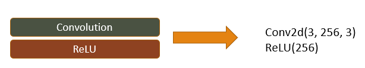

# EDSR  
  

EDSR은 ResNet에 SR기술을 접목시킨 네트워크 입니다.  
기존 VDSR, SRResNet을 개선시킨 모델로 전체 네트워크 구조는 무겁지만 준수한 정확도를 보입니다.  

## Residual Network과 SuperResolution
EDSR은 Residual Network 기반 딥러닝 모델입니다.  
또한 VDSR, SRResNet을 개선시킨 모델입니다.  
EDSR을 설명하기에 앞서 이 둘을 설명하려고 합니다.  

**Residual Network**  
 

일반적으로 깊은 딥러닝 모델로 네트워크를 설계하면 연산 량과 파라미터 수가 많아집니다.  
이러한 깊은 네트워크를 학습할 때, 역전파 과정에서 입력층으로 갈수록 기울기가 점차 작아지는 현상인 기울기 소실현상과 기울기 폭주현상이 발생할 수 있습니다.  
따라서 단순히 네트워크를 깊게 설계를 해도 성능이 반드시 비례하는 것은 아닙니다.  
이러한 문제를 해결하기 위해 Residual Network가 제안되었습니다.  

Residual Network는 잔차를 학습하는 네트워크 입니다.  
잔차는 입력 값과 출력 값의 차이인데 SR에서는 Low Resolution과 High Resolution의 차이를 학습하는 것을 의미합니다.  
이러한 LR, HR의 차이 값을 이용하여 SR기술을 적용시킨 최초의 모델이 VDSR이고 그 뒤, SRResNet이 등장하게 됩니다.  
EDSR은 VDSR, SRResNet을 개선시킨 모델입니다.  

**VDSR**  
  
VDSR은 Residual Network를 SR에 가장 먼저 접목시킨 모델입니다.  
LR 이미지를 입력 받아 Bicubic Interpolation을 적용시킨 뒤, 해당 시점을 저장합니다.  
그 뒤 Residual Block을 통과한 결과와 이전에 저장한 입력 정보를 합쳐서 HR 이미지를 생성합니다.  
이 때, Residual Block은 해당 기술이 발표된 시기에 상대적으로 깊은 20층으로 구성되어서 주목을 많이 받았습니다.  
성능 또한 기존 SRCNN과 비교를 해서 우수한 성능을 보였습니다.  

  
VDSR은 SRCNN과 마찬가지로 학습 데이터를 Bicubic Interpolation을 적용시켜 업 스케일링을 진행한 LR을 이용합니다.  
마찬가지로, 이러한 과정에서 계산 복잡도가 HR 이미지에 대해 2차적으로 증가하게 됩니다.  
또한 ResNet은 HR 이미지 처리에 관련하여 분류와 탐지에 초점을 맞추고 있습니다.  

이러한 문제를 해결하기 위하여 SRResNet이라고 하는 ResNet을 SR에 적합하게 재설계한 모델이 등장하였고 EDSR은 SRResNet의 Residual Block을 더 개선한 모델입니다.  
SRResNet은 SRGAN의 Generator Network(생성 모델)로 불리기도 합니다.  
  
## EDSR 전체 네트워크 구조
  
EDSR의 전체 네트워크 구조입니다.
전 처리, ResBlock, 업 스케일링 총 3단계로 구성됩니다.  

**Head(Pre-processing)**  
  
EDSR의 첫 번째 단계인 전 처리 과정입니다.
해당 단계에서는 한 개의 Convolution 층을 통과합니다.  
전 처리 단계의 필터의 크기는 3X3로 설정합니다.  

**Body(ResBlock)**  
  
EDSR의 두 번째 단계인 ResBlocks 입니다.  
해당 단계에서는 LR 이미지가 여러 개의 ResBlock를 통과합니다.  

SRResNet과의 차이점은 BN(Batch Normalization layer)를 제거한 점입니다.
BN은 특징 값들을 정규화 합니다.  
이러한 과정은 특징 값들의 다양성을 제거하며, 아예 해당 과정을 거치지 않는게 더 좋은 결과를 보입니다.  
또한 BN과정을 제거함으로써 GPU 메모리 사용량을 SRResNet과 비교하여 40%감소하였습니다.  
결론적으로 SRResNet과 비교하여 계산 복잡도는 제한한 상태로 모델을 확장하고 더 높은 성능을 나타냅니다.  

ResBlock은 총 32개층으로 구성되어 있으며 각각을 스킵 커넥션을 사용해 연결합니다.  
스킵 커넥션은 잔차를 구할 때 원본 입력 데이터를 특정 구간을 통과하지 않고 연결되는 것을 의미합니다.  
이 과정에서 Feature Map이 계속해서 누적이 되면서 분산 값이 커지는 현상이 발생합니다.  
이러한 현상은 학습에 큰 영향을 미치게 되는데, 이를 해결하기 위해 각각의 ResBlock 마지막에 Multi라고하는 특정 상수를 곱해주는 층을 추가합니다.  

**Tail(Upscaling)**  
  
EDSR의 마지막 단계인 Upscaling입니다.  
해당 단계에서는 업 스케일링 파라미터 수치에 따라 각기 다른 층을 통과합니다.  
X2, X3은 Conv, Shuffle 한 번, X4는 두 번 통과하며 각각 내부 파라미터 수치도 다릅니다.  

Convolutional 층에서 업 스케일링 요소의 제곱 배 만큼 이미지를 확장하여 PixelShuffle을 통해 적절히 재배치 합니다.  
이 과정을 통해 VDSR이 사용한 Bicubic Interpolation보다 효율적인 연산이 가능하고 정확도 또한 높아졌습니다.  
