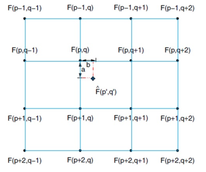
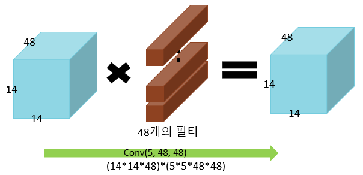
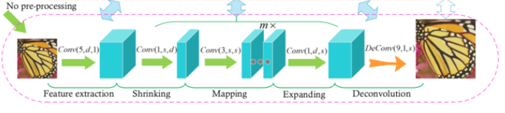
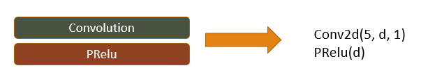
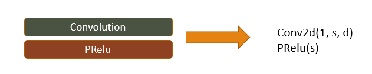
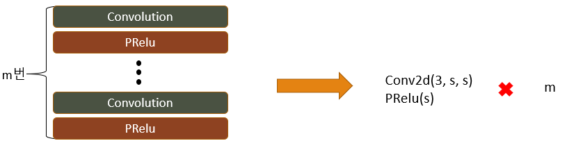
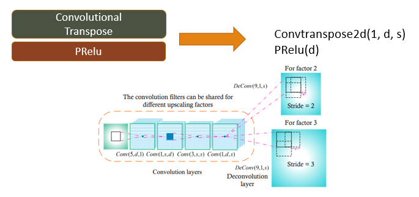
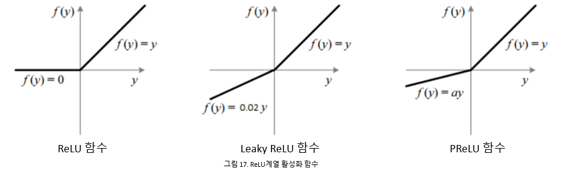
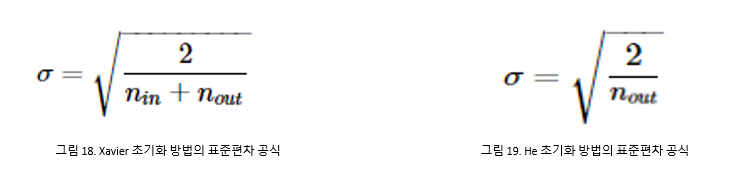

# FSRCNN  
  

FSRCNN은 SRCNN의 단점을 보완하고 가속시킨 네트워크 입니다.  
특징 추출, 축소, 매핑, 확장, 업 스케일 5단계로 구성됩니다.  
가장 큰 장점은 SRCNN의 정확도를 유지하면서 속도를 최대 40배 가속이 된다는 점입니다.

## SRCNN의 2가지 문제점
본 논문에서는 SRCNN의 2가지 문제점을 제안한다.  
  
**우선 첫 번째는 Bicubic Interpolation입니다.**  
 

SRCNN은 LR(Low Resolution) 이미지와 HR(High Resolution) 이미지간 매핑을 하기전에 Bicubic을 이용한 업 스케일링 과정을 진행합니다.  
이 과정에서 아래와 같은 문제점이 발생합니다.  
1) 계산 복잡도는 HR 이미지에 따라 2차적으로 증가합니다. (W = n2)  

2) 테스트를 할 때, Bicubic Interpolation을 사용하지 않은 이미지에 대해서는 정확도가 떨어지거나 Bicubic Interpolation 과정을 거친 이미지에 대해 특징점을 잘못 잡아서 잘못된 학습이 될 수 있습니다.  
  

**두 번째는 비 선형 매핑 구간입니다.**  
 

SRCNN은 LR의 특징에 대해 HR 특징과 복잡한 매핑이 이루어집니다.  
이러한 이유로 계산복잡도가 기하급수적으로 증가하게 되며 이것은 속도의 저하로 연결됩니다.
  
**FSRCNN의 주목해야할 주요 관점**  
FSRCNN은 SRCNN의 위 2가지 문제를 해결하기 위해 3가지 방안을 제시했습니다.  
1) Bicubic Interpolation 문제를 해결하기 위해 해당 구간을 삭제하고 마지막 구간에 DeConvolution 단계를 추가하여 이미지를 매핑 후에 확장한다
2) 기존 비 선형 매핑 단계를 축소, 매핑, 확장 3단계로 분리합니다.
3) 전체적으로 작은 필터를 사용하며 층을 깊게 설계해서 정확도를 유지시키고 속도를 높입니다.

## FSRCNN의 전체 네트워크 구조
  
위 그림은 FSRCNN의 전체 네트워크 구조입니다.  
총 5단계(특징 추출 -> 축소 -> 매핑 -> 확장 -> 업 스케일)로 구성됩니다.  

**특징 추출(Feature Extraction)**  
    

FSRCNN 네트워크의 5단계 중 첫 번째 단계인 특징 추출입니다.  
기존 SRCNN은 입력 데이터를 Bicubic Interpolation을 이용하여 업 스케일링을 한 이미지를 사용합니다.  
그에 반해, FSRCNN은 원본 이미지를 그대로 입력 데이터로 이용합니다.  
기존 SRCNN이 9X9 필터를 사용했지만 FSRCNN은  5X5 필터를 사용합니다.
이유는 5X5필터는 9X9필터를 통해 얻는 정보의 대부분을 담을 수 있기 때문에 더 작은 필터를 채택한 것입니다.  
입력 받은 d인자를 통해 출력한 채널의 크기(필터의 개수)를 결정합니다.  

**축소(Shrinking)**  
  
FSRCNN 네트워크의 5단계 중 두 번째 단계인 축소 단계입니다.  
기존 SRCNN에서는 고차원 LR 이미지와 고차원 HR 이미지가 직접적으로 매핑 되면서 계산 복잡도가 높아지는 현상이 있었습니다.  
이러한 문제를 해결하기 위해 FSRCNN은 비 선형 매핑 단계를 축소, 매핑, 확장 3단계로 분리하였습니다.  
  
FSRCNN은 원본 이미지를 그대로 입력 데이터로 이용을 하지만, 그대로 매핑을 진행하면 특징점을 찾는데 어려움이 있습니다.  
이를 위해 필터의 크기를 1X1로 설정하여 축소 단계를 진행합니다.  
필터의 크기를 1X1로 설정하는 것으로 LR 이미지에 대해 선형조합적으로 작동을 하게 됩니다.  
입력 받은 인자 s를 이용하여 축소할 채널의 크기를 결정합니다.  

**매핑(Mapping)**  
  
FSRCNN 네트워크의 5단계 중 세 번째 단계인 매핑 단계입니다.  
비 선형 매핑 단계는 SR성능에 영향을 미치는 가장 중요한 부분입니다.  
가장 큰 영향을 미치는 요소는 매핑 층의 개수와 필터의 크기입니다.  
SRCNN에서는 5X5필터를 사용하였는데, 해당 크기의 필터는 1X1필터보다 우수한 성능을 가집니다.  
네트워크의 규모와 성능을 모두 좋게 할 수는 없으므로, 타협점으로 3X3필터를 사용하고 여러 번 층을 쌓습니다.  
입력 받은 인자 m을 이용하여 매핑 층의 개수를 결정합니다.  

**확장(Expanding)**  
  
FSRCNN 네트워크의 5단계 중 네 번째 단계인 확장 단계입니다.  
FSRCNN 네트워크는 매핑 이전에 계산 효율성을 위해 LR 이미지의 채널을 축소합니다.  
축소된 상태에서 이미지를 복원하게 되면 최종 이미지의 품질이 많이 떨어지게 됩니다.  
이를 방지하기 위해 확장 레이어를 통해 매핑이 끝난 이미지를 축소 이전의 채널의 크기와 동일하게 확장하는 과정을 진행합니다.  
축소와의 일관성을 위해 필터의 크기는 1*1로 설정합니다.  
채널의 크기는 이전 채널의 크기(d)와 동일하게 설정합니다.  

**업 스케일링(Deconvolutional Layer)**  
  
FSRCNN 네트워크의 5단계 중 마지막 단계인 업 스케일링 단계입니다.  
매핑 후 확장까지 완료된 이미지를 업 스케일링 하는 단계입니다.  
FSRCNN은 Deconvolution Layer로 지정하여 업 스케일링을 진행하게 되는데, Convolutional Transpose를 이용합니다.  
Deconvolution은 Convolution의 역 연산으로 간주할 수 있습니다.  
입력 받은 업 스케일링 요소에 따라 스케일링 규모를 지정할 수 있습니다.  

업 스케일링 과정은 해당 층에서만 연산 됩니다.  
때문에 업 스케일링 요소에 관계 없이 모든 이미지가 기존 레이어의 가중치와 편향 값을 공유합니다.  
이러한 이유로 학습을 하는 시간을 감소시킬 수 있습니다.  

## FSRCNN 세부 구조
이전까지는 FSRCNN 네트워크의 전체적인 구조를 살펴봤으면 이번에는 FSRCNN의 세부 정보를 살펴보려고 합니다.
  
**최적화 함수(Optimizer)와 손실함수(Cost Function)**  
FSRCNN은 최적화 함수(Optimizer)로 Adam을 선정했습니다.  
Adam은 Momentum과 AdaGrad 섞은 기법입니다.  
Momentum은 학습이 진행됨에 따라 기울기가 업데이트 되는 폭을 조절을 하는 방식입니다.  
AdaGrad는 과거의 기울기의 값을 계속해서 제곱해서 더하면서 학습을 진행하는 방식입니다.  

손실 함수(Cost Function)은 MSE(평균 제곱 오차)를 사용합니다.  

**활성화 함수(Activation Function)**  
  
FSRCNN에서 사용하는 활성화 함수를 설명하려고 합니다.  
CNN에 대한 활성화 함수는 Relu 계열의 함수를 주로 사용합니다.  
ReLU 계열의 활성화 함수로는 ReLU, Leaky ReLU, PReLU 함수가 있습니다.  
ReLU와 Leaky ReLU 함수는 양의 값은 그대로 출력하고 음의 값은 0이 되거나 특정 상수로 출력을 합니다.  
PReLU는 음의 값을 상수로 출력하지 않고 별도의 Gradient를 적용하여 특정 값을 출력 합니다.  

SRCNN에서는 ReLU 함수를 선정했지만, FSRCNN에서는 PReLU 함수를 선정했습니다.  
ReLU 함수의 0이하의 값을 무조건 0으로 만드는 zero-gradient 현상으로 인해 이미지의 특징(뉴런)이 사라지는(죽는) 현상을 방지하기 위함 입니다.  
또한 ReLU함수 보다 PReLU가 학습 결과가 더 좋다는 것은 논문[2]를 통해 어느정도 입증이 됐습니다.  
[2] He, K., Zhang, X., Ren, S., Sun, J.: Delving deep into rectifiers: Surpassing human-level performance on imagenet classification. In: ICCV. (2015) 1026–1034  

**가중치 초기화**  
  
FSRCNN의 가중치 초기화 방식에 대한 설명입니다.  
FSRCNN의 Convolutional Layer에서는  2015년에 출시된 PReLU와 He 가중치 초기화 방법에 대해 연구한 논문[2]에 근거하여 PReLU를 사용하였고 이에 적합한 방식으로 초기화합니다.  

가중치를 초기화하는 방법에는 0으로 초기화를 하거나 랜덤 값으로 초기화를 하거나 기존에 많이 사용된 세이비어(Xavier)초기화 방법과 FSRCNN에 사용된 He초기화 방법 등이 있습니다.  
He초기화 방법은 균등분포 방식과 정규분포 방식이 있는데 FSRCNN은 정규분포 방식으로 초기화를 진행합니다.  
평균은 0, 표준 편차를 출력 층의 채널의 개수로 정하는데 이전 세이비어 초기화 방식과 차이점은 표준 편차의 계산에 사용되는 인자 값에 입력, 출력 두 개의 인자가 필요 없이 하나만 필요하다는 점입니다.  
FSRCNN의 Deconvolution Layer에서는 PReLU같은 활성화 함수가 없기 때문에 SRCNN과 같은 방식으로 초기화 합니다. (평균 0, 표준 편차가 0.001인 정규분포에서 무작위 취득)  

