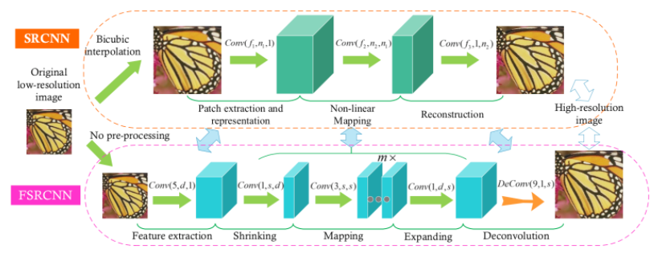

# FSRCNN  
  

FSRCNN은 SRCNN의 단점을 보완하고 가속시킨 네트워크 입니다.  
특징 추출, 축소, 매핑, 확장, 업 스케일 5단계로 구성됩니다.  
가장 큰 장점은 SRCNN의 정확도를 유지하면서 속도를 최대 40배 가속이 된다는 점입니다.

## SRCNN의 2가지 문제점
본 논문에서는 SRCNN의 2가지 문제점을 제안한다.  
  
**우선 첫 번째는 Bicubic Interpolation입니다.**  
 

SRCNN은 LR(Low Resolution) 이미지와 HR(High Resolution) 이미지간 매핑을 하기전에 Bicubic을 이용한 업 스케일링 과정을 진행합니다.  
이 과정에서 아래와 같은 문제점이 발생합니다.  
1) 계산 복잡도는 HR 이미지에 따라 2차적으로 증가합니다. (W = n2)  

2) 테스트를 할 때, Bicubic Interpolation을 사용하지 않은 이미지에 대해서는 정확도가 떨어지거나 Bicubic Interpolation 과정을 거친 이미지에 대해 특징점을 잘못 잡아서 잘못된 학습이 될 수 있습니다.  
  

**두 번째는 비 선형 매핑 구간입니다.**  
 

SRCNN은 LR의 특징에 대해 HR 특징과 복잡한 매핑이 이루어집니다.  
이러한 이유로 계산복잡도가 기하급수적으로 증가하게 되며 이것은 속도의 저하로 연결됩니다.
