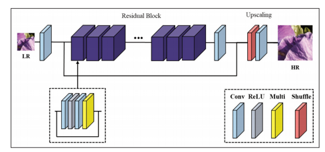

# SuperResolution
SuperResolution은 저해상도로 고해상도로 바꾸는 이미지를 바꾸는 기술입니다.  
본 연구에서는 다양한 SR기술에 관련된 논문을 소개하고 코드로 구현하여 정리하려고 합니다.  
(@ Code는 오픈소스를 활용하여 재구성 하였습니다.)  
(@ 무단 복제를 금지하며 출처를 언급한 경우에는 사용이 가능합니다.)

## FSRCNN
  
| 유형 | 링크 |
|---|:---:|
| 원본 논문 | [Accelerating the Super-Resolution Convolutional Neural Network](https://arxiv.org/abs/1608.00367) |
| 논문 정리 |[FSRCNN](https://github.com/KHS0616/SuperResolution/blob/master/Paper/FSRCNN.md)|  

FSRCNN은 SRCNN을 가속한 네트워크 입니다.
특징 추출, 축소, 매핑, 확장, 업 스케일 5단계로 구성됩니다.  
가장 큰 장점은 SRCNN의 정확도를 유지하면서 속도를 최대 40배 가속이 된다는 점입니다.

## EDSR
  
| 유형 | 링크 |
|---|:---:|
| 원본 논문 | [Enhanced Deep Residual Networks for Single Image Super-Resolution](https://arxiv.org/pdf/1707.02921.pdf) |
| 논문 정리 |[EDSR](https://github.com/KHS0616/SuperResolution/blob/master/Paper/EDSR.md)|  

EDSR은 ResNet에 SR기술을 접목시킨 네트워크 입니다.  
기존 VDSR, SRResNet을 개선시킨 모델로 전체 네트워크 구조는 무겁지만 준수한 정확도를 보입니다.
  
## CycleGAN
  
| 유형 | 링크 |
|---|:---:|
| 원본 논문 | [Unpaired Image-to-Image Translation using Cycle-Consistent Adversarial Networks](https://arxiv.org/pdf/1703.10593.pdf) |
| 논문 정리 |[CycleGAN](https://github.com/KHS0616/SuperResolution/blob/master/Paper/CycleGAN.md)|  

CycleGAN은 비지도학습 유형중 GAN을 이용한 딥러닝 네트워크 입니다.  
기존 GAN은 서로 짝이 맞는 데이터가 있어야 했는데, CycleGAN은 짝이 안 맞는 이미지간 학습이 가능하다는 특징이 있습니다.  