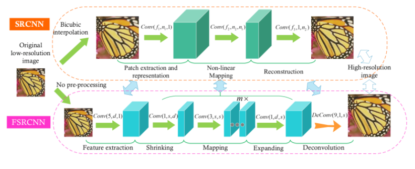

# SuperResolution
SuperResolution은 저해상도로 고해상도로 바꾸는 이미지를 바꾸는 기술이다.  
본 연구에서는 다양한 SR기술에 관련된 논문을 소개하고 코드로 구현하여 정리하려고 한다.

## FSRCNN
  
| 유형 | 링크 |
|---|:---:|
| 원본 논문 | [Accelerating the Super-Resolution Convolutional Neural Network](https://arxiv.org/abs/1608.00367) |
| 논문 정리 |[FSRCNN](https://github.com/KHS0616/SuperResolution/blob/master/Paper/FSRCNN.md)|  

FSRCNN은 SRCNN을 가속한 네트워크 입니다.
특징 추출, 축소, 매핑, 확장, 업 스케일 5단계로 구성됩니다.  
가장 큰 장점은 SRCNN의 정확도를 유지하면서 속도를 최대 40배 가속이 된다는 점입니다.

## EDSR
EDSR은 ResNet에 SR기술을 접목시킨 네트워크 입니다.  
기존 VDSR, SRResNet을 개선시킨 모델로 전체 네트워크 구조는 무겁지만 준수한 정확도를 보입니다.
